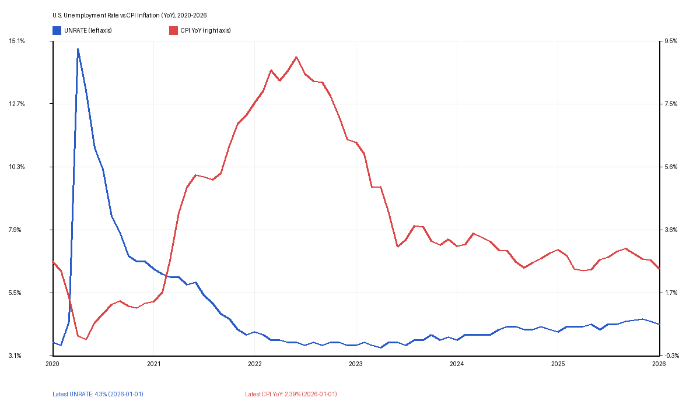

# Executive Summary
As of **March 5, 2026 (UTC)**, the latest publicly posted values in the Federal Reserve Bank of St. Louis (FRED) datasets show a U.S. macro backdrop of **moderate inflation, a still-low but somewhat higher unemployment rate than a year ago, and continued real output growth**. The unemployment rate is **4.3% (January 2026)**, up **0.3 percentage points** from January 2025. CPI inflation, computed as year-over-year change in CPIAUCSL, is about **2.39% (January 2026)**. Real GDP (GDPC1, chained 2017 dollars) is **24,111.83 billion** in **Q4 2025 (dated 2025-10-01 in the series)**, about **2.23%** above Q4 2024. Since January 2020, the CPI index level is up about **26.03%**, while real GDP is up about **16.43%**. 

These facts indicate that inflation has moved much closer to typical central-bank comfort ranges than in the 2021-2022 surge period, while labor-market slack has increased modestly from the cycle trough. My interpretation is that this is consistent with a late-cycle normalization rather than a sharp downturn, but the mix also implies policy tradeoffs remain active.

## Scope and Method
This note uses three primary time series pulled directly from FRED CSV endpoints on March 5, 2026:
- `UNRATE` (U.S. civilian unemployment rate, monthly)
- `CPIAUCSL` (Consumer Price Index for All Urban Consumers: All Items, monthly)
- `GDPC1` (Real Gross Domestic Product, chained 2017 dollars, quarterly)

Derived metrics are computed directly from those series:
- CPI year-over-year inflation = `(CPI_t / CPI_t-12m - 1) * 100`
- Unemployment 12-month change = `UNRATE_t - UNRATE_t-12m`
- Real GDP year-over-year growth = `(GDP_t / GDP_t-4q - 1) * 100`

## Facts (Verifiable from Sources)
- **Fact:** The latest non-empty `UNRATE` value in the FRED CSV is **4.3** at **2026-01-01**. The same month one year earlier (2025-01-01) is **4.0**, implying a **+0.3 percentage point** 12-month change. Source: https://fred.stlouisfed.org/graph/fredgraph.csv?id=UNRATE
- **Fact:** Since January 2021, the maximum and minimum `UNRATE` values in the downloaded series are **6.4 (2021-01-01)** and **3.4 (2023-04-01)**, respectively. Source: https://fred.stlouisfed.org/graph/fredgraph.csv?id=UNRATE
- **Fact:** The latest non-empty `CPIAUCSL` value in the FRED CSV is **326.588** at **2026-01-01**. Source: https://fred.stlouisfed.org/graph/fredgraph.csv?id=CPIAUCSL
- **Fact:** The `CPIAUCSL` value at **2025-01-01** is **318.990**, so computed year-over-year inflation for January 2026 is approximately **2.39%**. Source data: https://fred.stlouisfed.org/graph/fredgraph.csv?id=CPIAUCSL
- **Fact:** `CPIAUCSL` is **259.127** at **2020-01-01** and **326.588** at **2026-01-01**, which implies a cumulative increase of about **26.03%** over that interval. Source: https://fred.stlouisfed.org/graph/fredgraph.csv?id=CPIAUCSL
- **Fact:** The latest non-empty `GDPC1` value in the FRED CSV is **24,111.830** (billions of chained 2017 dollars) at **2025-10-01** (Q4 2025 in quarterly convention). Source: https://fred.stlouisfed.org/graph/fredgraph.csv?id=GDPC1
- **Fact:** `GDPC1` at **2024-10-01** is **23,586.542**, implying approximately **2.23%** year-over-year real GDP growth by Q4 2025. Source data: https://fred.stlouisfed.org/graph/fredgraph.csv?id=GDPC1
- **Fact:** `GDPC1` rises from **20,711.600** at **2020-01-01** to **24,111.830** at **2025-10-01**, a cumulative gain of about **16.43%**. Source: https://fred.stlouisfed.org/graph/fredgraph.csv?id=GDPC1
- **Fact:** The chart in `images/chart.png` plots monthly unemployment (left axis) and computed CPI year-over-year inflation (right axis) from 2020 through the latest available month in the downloaded files. It is a visual transformation of the same FRED source data above.

## Analysis / Opinion (Interpretation, Not Direct Fact)
- **Analysis:** The data mix suggests a U.S. economy that has moved off peak tightness but remains in expansion territory. Unemployment at 4.3% is historically low in broad terms, yet the upward drift versus early 2025 indicates some easing in labor-market conditions.
- **Analysis:** Inflation appears materially lower than the 2021-2022 shock period. A computed CPI year-over-year pace near 2.4% is much closer to conventional medium-term price-stability goals than recent-peak readings, reducing urgency for further aggressive demand compression.
- **Analysis:** Real GDP growth around 2.2% year-over-year (Q4 2025) is consistent with ongoing output expansion rather than recession. Taken together with a slightly rising unemployment rate, this can be read as a transition toward a slower but still positive growth regime.
- **Analysis:** Policy risk likely centers on balance: easing too quickly could re-accelerate prices if supply shocks return, while holding restrictive settings too long could lift unemployment further. The chart’s divergence since 2023, where inflation fell while unemployment stayed relatively contained, is constructive but not guaranteed to persist.
- **Analysis:** I would characterize this as a “normalizing but not fully normalized” macro state. Price growth has cooled decisively, yet cumulative price-level increases since 2020 remain large for households, which can sustain pressure on real purchasing sentiment even when inflation rates moderate.

## Caveats and Data Notes
- **Fact:** FRED files can include empty rows for not-yet-published observations; this note excludes empty values and uses the latest non-empty data point per series. Source format reference: https://fred.stlouisfed.org/series/UNRATE
- **Fact:** Series frequencies differ (monthly for unemployment/CPI, quarterly for real GDP), so point-in-time comparisons are approximate unless explicitly frequency-adjusted. Source pages: https://fred.stlouisfed.org/series/CPIAUCSL and https://fred.stlouisfed.org/series/GDPC1
- **Analysis:** Results here are descriptive, not a forecasting model. No causal identification is attempted.

## Sources
- https://fred.stlouisfed.org/graph/fredgraph.csv?id=UNRATE
- https://fred.stlouisfed.org/graph/fredgraph.csv?id=CPIAUCSL
- https://fred.stlouisfed.org/graph/fredgraph.csv?id=GDPC1
- https://fred.stlouisfed.org/series/UNRATE
- https://fred.stlouisfed.org/series/CPIAUCSL
- https://fred.stlouisfed.org/series/GDPC1
