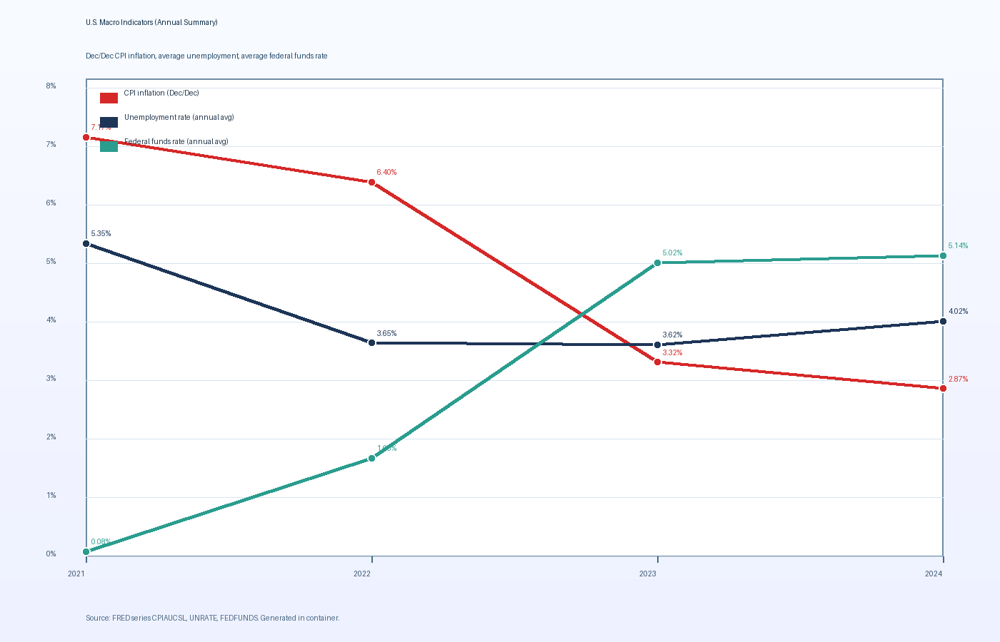

# Executive Summary

This note reviews recent U.S. macroeconomic conditions using three monthly indicators from the Federal Reserve Economic Data (FRED) platform: CPI inflation proxy (CPIAUCSL), unemployment (UNRATE), and the effective federal funds rate (FEDFUNDS). Across 2021 to 2024, the data show a clear disinflation pattern (from very high inflation in 2021–2022 toward lower rates in 2023–2024), while labor market tightness eased only modestly and policy rates stayed restrictive through 2024 before beginning to move lower by early 2026. The combined signal is consistent with a late-cycle normalization dynamic rather than a collapse in activity.

As of the latest available observations in these downloaded series (CPI and unemployment through January 2026, fed funds through February 2026), inflation pressure is far below the 2021–2022 peak, unemployment is higher than the 2023 trough but not historically extreme, and short-term policy rates have begun to decline from 2024 averages. That pattern is important for planning assumptions: inflation risk remains nonzero, but rate-path risk now includes both easing and re-acceleration scenarios.

## Scope and Method

This report uses raw CSV extracts from FRED for:

- CPIAUCSL (Consumer Price Index for All Urban Consumers: All Items in U.S. City Average): https://fred.stlouisfed.org/series/CPIAUCSL
- UNRATE (Civilian Unemployment Rate): https://fred.stlouisfed.org/series/UNRATE
- FEDFUNDS (Effective Federal Funds Rate): https://fred.stlouisfed.org/series/FEDFUNDS

Downloaded data endpoints:

- https://fred.stlouisfed.org/graph/fredgraph.csv?id=CPIAUCSL
- https://fred.stlouisfed.org/graph/fredgraph.csv?id=UNRATE
- https://fred.stlouisfed.org/graph/fredgraph.csv?id=FEDFUNDS

Annual figures in this note are calculated as follows:

- CPI inflation: December-over-December percent change from CPIAUCSL index levels.
- Unemployment: arithmetic average of monthly UNRATE values for each calendar year.
- Federal funds rate: arithmetic average of monthly FEDFUNDS values for each calendar year.

Latest point-in-time values are taken from the most recent non-empty observation in each downloaded series. Federal Reserve policy context can be cross-checked on the FOMC landing page: https://www.federalreserve.gov/monetarypolicy/openmarket.htm

## Facts (Source-Grounded)

1. **Disinflation from peak levels is visible in annual CPI changes.**
   - Computed December-over-December inflation from CPIAUCSL was 7.17% (2021), 6.40% (2022), 3.32% (2023), and 2.87% (2024).
   - Source data: https://fred.stlouisfed.org/graph/fredgraph.csv?id=CPIAUCSL

2. **Unemployment stayed low by post-2008 standards, though it rose off the 2023 lows in 2024.**
   - Annual average UNRATE was 5.35% (2021), 3.65% (2022), 3.62% (2023), and 4.02% (2024).
   - Source data: https://fred.stlouisfed.org/graph/fredgraph.csv?id=UNRATE

3. **The effective federal funds rate shifted from near-zero to restrictive levels by 2023–2024.**
   - Annual average FEDFUNDS was 0.08% (2021), 1.68% (2022), 5.02% (2023), and 5.14% (2024).
   - Source data: https://fred.stlouisfed.org/graph/fredgraph.csv?id=FEDFUNDS

4. **Latest observations in the downloaded series indicate easing rates and moderate labor softening.**
   - CPIAUCSL latest point: 326.588 on 2026-01-01.
   - UNRATE latest point: 4.3% on 2026-01-01.
   - FEDFUNDS latest point: 3.64% on 2026-02-01.
   - Source data: same three FRED CSV endpoints above.

5. **Indicator definitions align with standard U.S. macro monitoring practice.**
   - CPIAUCSL definition page: https://fred.stlouisfed.org/series/CPIAUCSL
   - UNRATE definition page: https://fred.stlouisfed.org/series/UNRATE
   - FEDFUNDS definition page: https://fred.stlouisfed.org/series/FEDFUNDS

### Computed Annual Summary

| Year | CPI Dec/Dec % | UNRATE avg % | FEDFUNDS avg % |
|---|---:|---:|---:|
| 2021 | 7.17 | 5.35 | 0.08 |
| 2022 | 6.40 | 3.65 | 1.68 |
| 2023 | 3.32 | 3.62 | 5.02 |
| 2024 | 2.87 | 4.02 | 5.14 |

## Analysis / Opinion

The data pattern suggests that policy tightening has been associated with a substantial reduction in inflation momentum, but with lagged side effects now appearing in labor-market slack and policy normalization. The strongest factual signal is the inflation step-down from 2021–2022 to 2023–2024. On a planning basis, that lowers the probability of a return to extreme near-term inflation prints, but it does not remove inflation risk: the CPI level is still rising, and a lower inflation rate is not the same as falling prices.

A second interpretation is that labor resilience has persisted longer than many recession forecasts implied. Even with unemployment rising from 2023 to 2024 annual averages, the level remains moderate relative to long-run U.S. history. That can support consumer demand and corporate revenue stability, but it can also keep wage and services inflation from fully converging to target quickly.

The third implication concerns rate-sensitive decisions. The 2024 average federal funds rate remained above 5%, while the latest monthly reading in this extract (3.64% in February 2026) indicates that the policy stance has already moved lower. For decision-makers in lending, capital budgeting, or discount-rate assumptions, this creates two-way risk: fixed-rate commitments made under peak-rate expectations may look expensive if easing continues, but floating exposures could still be vulnerable if inflation re-accelerates and easing pauses.

From a risk-management perspective, the best near-term posture is conditional planning rather than single-scenario forecasting. A practical baseline is “disinflation with slower growth,” with explicit contingencies for two alternatives: (a) sticky inflation that keeps policy tighter for longer, and (b) faster labor deterioration that accelerates policy easing. Monitoring monthly updates to the same three series is sufficient to detect which path is becoming more likely.

## Limitations

- This is a compact indicator-based note, not a structural macro model.
- Annual averages smooth within-year turning points.
- CPIAUCSL is one inflation proxy; complementary measures (for example PCE inflation) could change interpretation at the margin.
- Correlation in these series does not prove causation.

## Source List (URLs)

- https://fred.stlouisfed.org/series/CPIAUCSL
- https://fred.stlouisfed.org/series/UNRATE
- https://fred.stlouisfed.org/series/FEDFUNDS
- https://fred.stlouisfed.org/graph/fredgraph.csv?id=CPIAUCSL
- https://fred.stlouisfed.org/graph/fredgraph.csv?id=UNRATE
- https://fred.stlouisfed.org/graph/fredgraph.csv?id=FEDFUNDS
- https://www.federalreserve.gov/monetarypolicy/openmarket.htm
